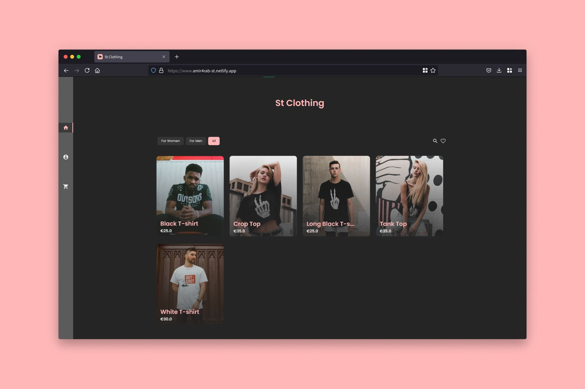

<h1 align="center">
  <p>a Simple🌠 and Fast🚀</p>
  <p>Ecommerce website</p>
</h1>

## ⚡ Live version 
- Avilable at [amir4rab-st.netlify.com](https://amir4rab-st.netlify.app/).

## 👾 About

#### Libraries:
- firebase
- gatsby
- react-redux
- shopify-buy

## 🚀 Cloning guide

1.  **Clone the code.**

    Use git to clone the website code.

    ```shell
    git clone https://github.com/amir4rab/gatsby-shopify-clothing-store
    cd gatsby-shopify-clothing-store
    ```

2.  **Add environment variables**

    start a firebase application and setup a shopify account.
    '.env.development' file should incloude the following values:
    ```json
    {
      SHOPIFY_SHOP_NAME= ***
      SHOPIFY_ACCESS_TOKEN= ***

      FIREBASE_API_KEY= ***
      FIREBASE_AUTH_DOMAIN= ***
      FIREBASE_PROJECT_ID= ***
      FIREBASE_STORAGE_BUCKET= ***
      FIREBASE_MESSAGING_SENDER_ID= ***
      FIREBASE_APP_ID= ***
      FIREBASE_DATABASE_URL= ***
    }
    ```
    also you need to replace '.env.production' with the following values:
    ```json
    {
      SHOPIFY_SHOP_NAME= ***
      SHOPIFY_ACCESS_TOKEN= ***

      FIREBASE_API_KEY= ***
      FIREBASE_AUTH_DOMAIN= ***
      FIREBASE_PROJECT_ID= ***
      FIREBASE_STORAGE_BUCKET= ***
      FIREBASE_MESSAGING_SENDER_ID= ***
      FIREBASE_APP_ID= ***
      FIREBASE_DATABASE_URL= ***
    }
    ```

3.  **Installing the dependencies**
    then write the following command:
    ```shell
      npm install
    ```

4. **Start developing**
    Everything is almost ready, just type the following command:
    ```shell
      npm run develop
    ```
    Your site is now running at http://localhost:8000!